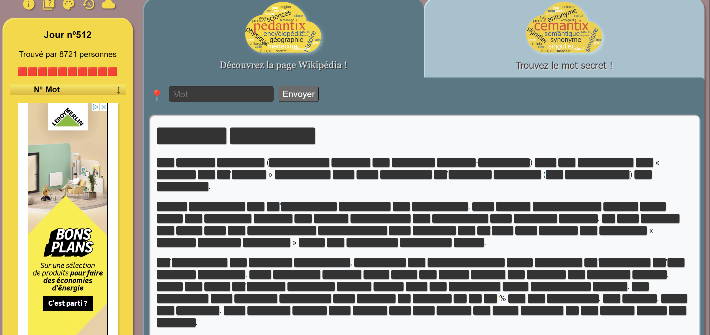
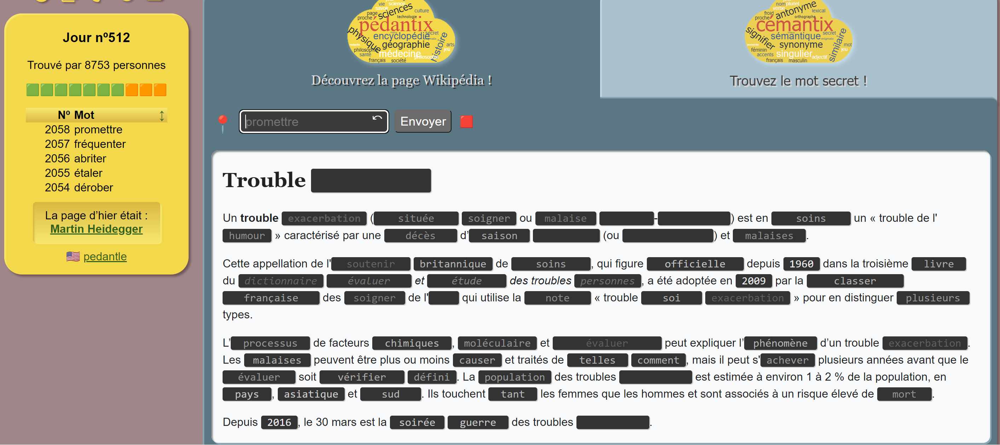
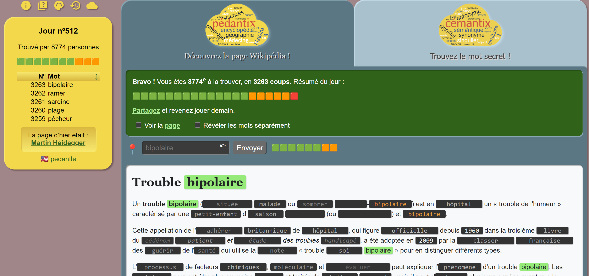

# [PROJECT]

# Using Selenium to crack the pedantix game

The goal of the game is to discover the Wikipedia page by revealing the words that make up its introduction through successive attempts.

The correct words will appear in plain text as you try them. Those that are close enough will remain grayed out with a shade of gray proportional to their proximity to the actual word in the lexical field. This proximity calculation is similar to the one used by Cémantix. You can see the length of a hidden word by clicking on its black box.

When the words that make up the title of the Wikipedia page are revealed, you have won! Note that the words in the title are either correct or incorrect; they are never grayed out. The singular masculine form of a word or the infinitive form of a verb may be enough to reveal its feminine, plural, or conjugated forms. Capitalization is not necessary.

It will take you more than 6 attempts; probably dozens. The ranking given to you at the end of the game is your position on the list of players who have found the page of the day, and it is independent of the number of attempts. At the end of the game, you can choose to display the page, reveal each word separately by clicking on its black box, or continue playing without spoilers.

A new randomly selected page is available every day at noon French time, which is 12:00 local time.






## How to launch the script ?

1. Clone this repo : ```git clone https://github.com/SalonTom/pedantix.git```

2. Go into the _seleniumVersion_ folder : ```cd ./pedantix/seleniumVersion```

3. Install the node_modules : ```npm install```

4. Launch the script : ```node crack.js```

Once the script is triggered, it will iterate throught the _words.json_ list of words and try them all. Fortunetly, it contains the word or words that are looked for. If not, it will give a huge head start to finish the challenge manually.